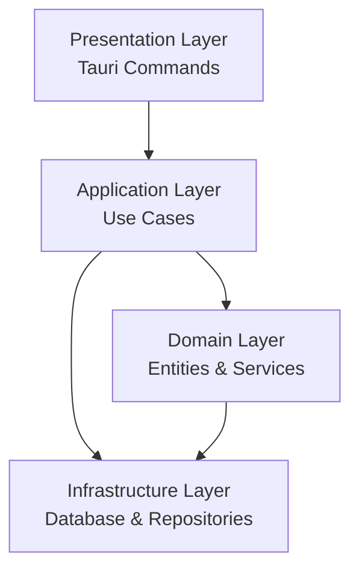

# Time Tracker Go

軽量で高速なmacOS向けタイムトラッキングデスクトップアプリケーション

## 概要

Time Tracker Goは、Tauri 2.xフレームワークを使用したローカル完結型のタイムトラッキングアプリケーションです。データはすべてローカルのSQLiteデータベースに保存され、外部との通信は行いません。

### 技術スタック

- **フレームワーク**: Tauri 2.x（2024年10月安定版）
- **バックエンド**: Rust
- **フロントエンド**: React + TypeScript
- **データベース**: SQLite（イミュータブルデータモデル）
- **開発手法**: DDD（ドメイン駆動設計）+ TDD（テスト駆動開発）
- **テスト**: Vitest + React Testing Library + Playwright

### 主要機能

- ✅ プロジェクト/タスクの作成・編集・削除
- ✅ 階層構造とステータス管理（active/archived）
- 🚧 タイムトラッキング（開始/停止/計測）
- 🚧 レポート生成機能
- 🚧 タグ機能

## 環境構築

### 必要な依存関係

1. **Rust**（最新安定版）
```bash
curl --proto '=https' --tlsv1.2 -sSf https://sh.rustup.rs | sh -s -- -y
source ~/.cargo/env
```

2. **Node.js**（v18以上）
```bash
brew install node
```

3. **ImageMagick**（アイコン生成用）
```bash
brew install imagemagick
```

### セットアップ手順

1. **リポジトリクローン**
```bash
git clone https://github.com/tonosama/time_tracking.git
cd time_tracking
```

2. **依存関係インストール**
```bash
# フロントエンド依存関係
npm install

# Rust依存関係（初回ビルド時に自動実行）
```

3. **アイコン作成**（必要に応じて）
```bash
cd src-tauri/icons
magick -size 32x32 xc:"rgba(70,130,180,1)" \
  -fill "rgba(255,255,255,1)" \
  -stroke "rgba(255,255,255,1)" \
  -strokewidth 2 \
  -draw "circle 16,16 16,6" \
  -strokewidth 1 \
  -draw "line 16,16 16,8" \
  -draw "line 16,16 22,16" \
  -fill "rgba(255,255,255,1)" \
  -draw "circle 16,16 16,14" \
  PNG32:icon.png
cd ../..
```

## 開発

### 開発サーバー起動

```bash
# Tauriアプリケーション（推奨）
npm run tauri:dev

# または、フロントエンドのみ
npm run dev
```

- **Tauriアプリ**: デスクトップアプリウィンドウが自動で開きます
- **フロントエンドのみ**: http://localhost:1420 でアクセス

### ビルド

```bash
# 開発ビルド
npm run build

# リリースビルド
npm run tauri:build
```

### テスト

```bash
# Unit/Integrationテスト
npm test

# Unit/Integrationテスト（UIモード）
npm run test:ui

# E2Eテスト（Playwrightが必要）
npm run test:e2e

# E2Eテスト（UIモード）
npm run test:e2e:ui

# Rustテスト
cd src-tauri && cargo test
```

## トラブルシューティング

### よくある問題

#### 1. アイコンエラー: "icon is not RGBA"

**症状**: Tauriコンパイル時にアイコン形式エラー

**解決策**:
```bash
cd src-tauri/icons
rm -f icon.png
# 上記のImageMagickコマンドでRGBA形式アイコンを再作成
```

#### 2. プロセス強制終了

**Tauriプロセスが残ってしまった場合**:
```bash
pkill -f "tauri|cargo.*tauri|vite|time-tracker-go"
```

#### 3. "プロジェクトの読み込みに失敗しました"

**症状**: UI上にエラーメッセージ表示

**説明**: 初期状態では正常です（データベースが空のため）

**解決策**: プロジェクト作成機能の実装完了後に解消されます

#### 4. ウィンドウが開かない

**確認方法**:
1. macOSのDockで青い時計アイコンを確認
2. `Command + Tab`でアプリケーション切り替え
3. ブラウザで http://localhost:1420 にアクセス

#### 5. Playwright E2Eテストエラー

**初回セットアップ**:
```bash
npx playwright install
```

## プロジェクト構造

```
time_tracking/
├── src/                        # フロントエンド（React/TypeScript）
│   ├── components/             # UIコンポーネント
│   │   └── projects/          # プロジェクト関連コンポーネント
│   ├── types/                 # TypeScript型定義
│   └── styles/                # CSS
├── src-tauri/                  # バックエンド（Rust）
│   ├── src/
│   │   ├── domain/            # ドメイン層（DDD）
│   │   │   ├── entities/      # エンティティ
│   │   │   ├── value_objects/ # 値オブジェクト
│   │   │   ├── repositories/  # リポジトリトレイト
│   │   │   └── services/      # ドメインサービス
│   │   ├── application/       # アプリケーション層
│   │   │   ├── use_cases/     # ユースケース
│   │   │   ├── dto/           # データ転送オブジェクト
│   │   │   └── services/      # アプリケーションサービス
│   │   ├── infrastructure/    # インフラ層
│   │   │   ├── database/      # データベース接続
│   │   │   └── repositories/  # リポジトリ実装
│   │   └── presentation/      # プレゼンテーション層
│   │       └── commands/      # Tauriコマンド
│   ├── icons/                 # アプリケーションアイコン
│   └── Cargo.toml            # Rust依存関係
├── tests/                     # テスト
│   ├── unit/                  # 単体テスト
│   ├── integration/           # 結合テスト
│   └── e2e/                   # E2Eテスト（Playwright）
├── database/                  # データベーススキーマ
│   └── migrations/           # マイグレーションSQL
└── doc/                       # ドキュメント
    ├── design_doc_time_tracker_go.md  # 設計文書
    └── backlog/              # プロダクトバックログ
```

### DDDアーキテクチャ



## データベース

### 特徴

- **イミュータブルデータモデル**: UPDATE/DELETEなし、INSERT-onlyで履歴管理
- **バージョン管理**: プロジェクト/タスクの変更履歴を保持
- **イベント駆動**: タイムトラッキングはイベントの畳み込みで状態導出

### スキーマ

- `projects` / `project_versions`: プロジェクト管理
- `tasks` / `task_versions`: タスク管理
- `time_entry_events`: タイムトラッキングイベント
- `tags` / `task_tag_events`: タグ管理

詳細は `doc/design_doc_time_tracker_go.md` を参照

## ライセンス

MIT License

## 貢献

1. Fork the repository
2. Create feature branch (`git checkout -b feature/amazing-feature`)
3. Commit changes (`git commit -m 'Add amazing feature'`)
4. Push to branch (`git push origin feature/amazing-feature`)
5. Open Pull Request

---

**バージョン**: 0.1.0  
**作成者**: tonosama  
**最終更新**: 2025-08-09